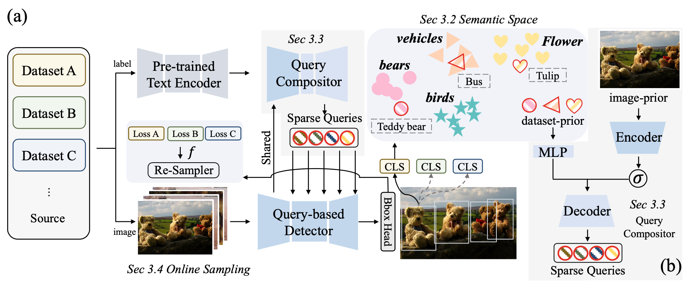

# Plain-Det

**The official PyTorch implementation of the "Plain-Det: A Plain Multi-Dataset Object Detector".**



By [Cheng Shi*](https://chengshiest.github.io/), Yuchen Zhu* and [Sibei Yang†](https://faculty.sist.shanghaitech.edu.cn/yangsibei/)

*Equal contribution; †Corresponding Author

## Highlights

- Plain-Det is accepted by ECCV2024!
- We will release the training code soon.

## Main results

### Table 1
  
| METHOD| COCO | LVIS | O365 | OID | mAP | Paper Position | CFG | CKPT |
| :---: | :---: | :---: | :---: | :---: | :---: | :---: | :---: | :---: |
|L| 37.2 | 33.3 | 13.4 | 35.3 | 29.8 | Tab1 line3 | cfg |ckpt
|CL| 46.0 | 33.2 | 14.2 | 35.7 | 32.3 | Tab1 line4 | cfg |ckpt
|CLO| 51.8 | 39.9 | 33.2 | 41.7 | 41.7 | Tab1 line5 | cfg | ckpt
|CLOD| 51.9 | 40.9 | 33.3 | 63.4 | 47.4 | Tab1 line6 | [cfg](./projects/deformable_detr/configs/deformable_detr_r50_two_stage_800k_clod.py) | [ckpt](https://drive.google.com/file/d/1PL2WM78Ikl_4yf4mh4N_grUhWb2rrZk7/view?usp=drive_link)

**Note:**

- We first release the results of CLOD(COCO, LVIS, Objects365, OIDv4). We are checking other training weights and will update the results soon.
- You can get the label embedding we use from [here](https://drive.google.com/drive/folders/1G102noS3TjIFkXnShKhaaQRSuPXORwjQ?usp=drive_link)

## Installation

### Conda

```bash
# create conda environment
conda create -n plaindet python=3.10.11 -y
conda activate plaindet

# install pytorch (other versions may also work)
pip install torch==2.0.0 torchvision==0.15.1 torchaudio==2.0.1

# other requirements
git clone https://github.com/ChengShiest/Plain-Det.git
cd Plain-Det

# install packages
pip install -r requirements.txt

# setup detectron2
python -m pip install -e detectron2

# setup detrex
python setup.py build develop
```

## Prepare datasets for Plain-Det

You can follow [detectron2](https://detectron2.readthedocs.io/en/latest/tutorials/builtin_datasets.html) to prepare the dataset.

## Usage

```bash

# You should change the dataset config in \
# ./projects/deformable_detr/configs/deformable_detr_r50_two_stage_800k_clod.py \
# to evaluate different datasets.

# run evaluation
bash scripts/eval.sh
```

## Citing Plain-Det

If you find Plain-Det useful in your research, please consider citing:

```
inproceedings{
  shi2024plain,
  title={Plain-Det: A Plain Multi-Dataset Object Detector},
}
```

## Acknowledgement

This code is based on [detrex](https://github.com/IDEA-Research/detrex) and [detectron2](https://github.com/facebookresearch/detectron2). Some code are brought from [Detic](https://github.com/facebookresearch/Detic) and [UniDet](https://github.com/xingyizhou/UniDet). Thanks for their awesome works.
